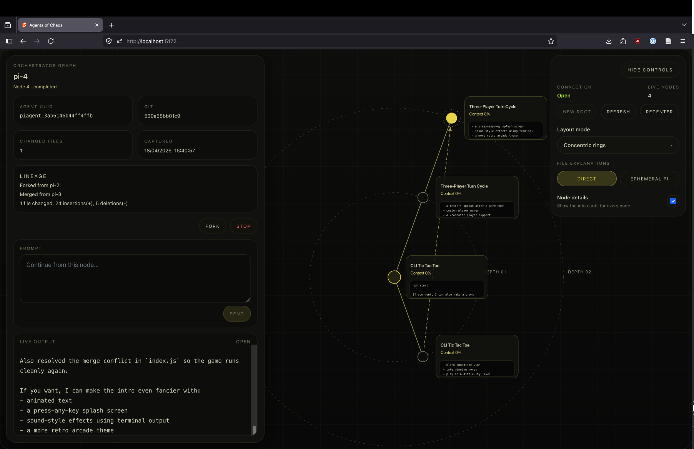

# agentsofchaos

**Agents of Chaos** is a graph-based interface for coding agents where agents can **branch, run in parallel, and merge back together like code**.

Instead of treating an agent as one long chat, this project makes agent work visible as a live graph:
- each node is an isolated agent instance
- branches preserve filesystem + agent session state
- merges create integration nodes instead of overwriting existing work
- users can inspect lineage, prompt individual nodes, and watch output live

## Hackathon pitch

The core idea is simple:

> **What if coding agents worked like git branches?**

Our demo shows exactly that:
- spin up a root agent
- fork it into parallel explorations
- let different branches try different implementations
- merge them back into a fresh integration node
- visualize the whole process as a navigable graph

## Recommended demo

The main demo is the Docker-orchestrated system in:
- `apps/orchestrator/`
- `apps/pi-worker/`

There is also an older reference prototype in:
- `apps/pi-rpc/`

## How it works

- each agent runs in its own **Docker container**
- the orchestrator manages agent lifecycle and event streaming
- forks are created from Docker snapshots so the child inherits:
  - filesystem state
  - git state
  - persisted pi session state
- merges are transported with **`git bundle`**, then applied in a new integration instance
- the frontend renders the instance graph and live terminal-style output

This keeps the demo grounded in real version-control semantics instead of faking branch behavior in memory.

## Layout

- `frontend/` — graph UI for the live demo
- `apps/orchestrator/` — backend orchestrator, REST/SSE/WebSocket control plane
- `apps/pi-worker/` — single-worker image that exposes a websocket bridge around `pi --mode rpc`
- `apps/pi-rpc/` — older all-in-one prototype kept around for reference

Worker containers now keep state in fixed in-container paths:

- `/workspace` — git repo state
- `/state/pi-agent` — pi session/state files
- `/state/meta` — future lineage/merge metadata

## Run the orchestrated demo

For a fuller setup guide, see:
- `docs/setup.md`

Start the backend orchestrator:

```bash
cd apps/orchestrator
./dev-up.sh
```

That script:

1. builds `agentsofchaos/pi-worker:latest`
2. starts the orchestrator with Docker socket access

The orchestrator listens on:

```text
http://localhost:3000
```

Port `3000` is **API/SSE only**.

Then start the graph frontend:

```bash
cd frontend
npm install
npm run dev
```

The graph UI will be available on Vite's default dev port, usually:

```text
http://localhost:5173
```

### Quick judge demo flow

1. create a single root node
2. send a prompt to the root
3. fork it into multiple branches
4. send different prompts to each branch
5. merge one branch back into an integration node
6. show that the original target branch stays untouched while the integration node reflects the merge result

For an automated smoke test when Docker is available:

```bash
cd apps/orchestrator
npm run e2e
```

## What the demo shows

- one root agent
- branch/fork into parallel agent nodes
- prompt nodes independently
- merge branches into a new integration node
- inspect the graph and live agent output in the UI

## Environment

Main env file for the orchestrated demo:

- `apps/orchestrator/.env`

Current default model:
- `openai/gpt-5.4-mini`

Template:

- `apps/orchestrator/.env.example`

The `.env` file is gitignored. Because the API key was shared in chat, rotate it after testing.

## Notes

- The orchestrator uses the Docker socket, so treat it as privileged.
- Worker containers are ephemeral and are removed when the browser websocket disconnects.
- Fork snapshots are also cleaned up when the session ends.
- Workers receive secrets like `OPENAI_API_KEY` via environment variables, not baked into the image.
- Workers now persist pi sessions under `/state/pi-agent` because they no longer run with `--no-session`.
- The orchestrator now has Docker-exec based helpers for git status, checkpoint commits, git bundle export/import, merge execution, latest-session extraction, and AI-generated merge context writing.
- Docker is required on the host. I could not test Docker orchestration on this VM because the Docker CLI/socket is not available here.
